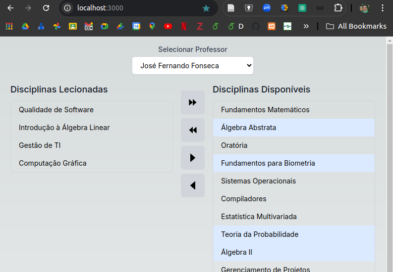

# Exercício para criação de back e front para manipulação das disciplinas dos professores

## Objetivo
Desenvolver os métodos de backend necessários para alimentar a aplicação Next.js, permitindo a interação com os dados de professores e disciplinas.

## Criação do Backend:

1. **Listar Professores**
   - **Método:** GET
   - **Endpoint:** `/api/professor`
   - **Descrição:** Retorna uma lista de todos os professores disponíveis.

2. **Listar Disciplinas Lecionadas**
   - **Método:** GET
   - **Endpoint:** `/api/disciplina/:professorId/lecionadas`
   - **Descrição:** Retorna uma lista de disciplinas que o professor especificado já leciona.

3. **Listar Disciplinas Disponíveis**
   - **Método:** GET
   - **Endpoint:** `/api/disciplina/:professorId/disponiveis`
   - **Descrição:** Retorna uma lista de disciplinas que o professor especificado ainda não leciona.

4. **Vincular Todas as Disciplinas Disponíveis ao Professor**
   - **Método:** POST
   - **Endpoint:** `/api/professor/:professorId/vincular_todas`
   - **Descrição:** Vincula todas as disciplinas disponíveis ao professor especificado.

5. **Desvincular Todas as Disciplinas Lecionadas do Professor**
   - **Método:** POST
   - **Endpoint:** `/api/professor/:professorId/desvincular_todas`
   - **Descrição:** Desvincula todas as disciplinas lecionadas do professor especificado.

6. **Vincular uma Disciplina ao Professor**
   - **Método:** POST
   - **Endpoint:** `/api/professor/:professorId/vincular`
   - **Descrição:** Vincula uma disciplina específica ao professor especificado.
   - **Payload:** `{ id_disciplina: number }`

7. **Desvincular uma Disciplina do Professor**
   - **Método:** POST
   - **Endpoint:** `/api/professor/:professorId/desvincular`
   - **Descrição:** Desvincula uma disciplina específica do professor especificado.
   - **Payload:** `{ id_disciplina: number }`

## Considerações
Esses métodos serão utilizados no frontend para gerir a relação entre professores e disciplinas, permitindo a vinculação e desvinculação de disciplinas conforme a necessidade. Certifique-se de que as respostas dos métodos GET retornem listas vazias ao invés de erros, caso não existam disciplinas lecionadas ou disponíveis.
Sugestão: crie um método cURL, como comentário, acima da definição de cada endpoint, para que o mesmo possa ser testado via console.

---

# Criação do Frontend

## Objetivo
Desenvolver a interface frontend de uma aplicação Next.js utilizando Hooks, TypeScript, e TailwindCSS, que permita a gestão de disciplinas lecionadas por professores, conforme especificado abaixo.

## Funcionalidades Requeridas

1. **Combo de Seleção de Professor**
   - **Descrição:** Um combo na parte superior da tela que permite selecionar um professor. Esse combo deve estar centralizado na tela e ocupar 1/3 da largura total.
   - **Interação:** Ao selecionar um professor, devem ser carregadas as disciplinas lecionadas e as disciplinas disponíveis para esse professor.

2. **Listas de Disciplinas**
   - **Descrição:** 
     - **Disciplinas Lecionadas:** Lista à esquerda, mostrando as disciplinas que o professor selecionado já leciona.
     - **Disciplinas Disponíveis:** Lista à direita, mostrando as disciplinas que o professor ainda não leciona.
   - **Seleção:** O usuário deve ser capaz de selecionar múltiplas disciplinas em ambas as listas.

3. **Botões de Ação**
   - **Descrição:** Quatro botões localizados entre as duas listas:
     - **Mover Todos para Direita:** Move todas as disciplinas lecionadas para a lista de disciplinas disponíveis.
     - **Mover Todos para Esquerda:** Move todas as disciplinas disponíveis para a lista de disciplinas lecionadas.
     - **Mover Selecionados para Direita:** Move as disciplinas selecionadas na lista de disciplinas lecionadas para a lista de disciplinas disponíveis.
     - **Mover Selecionados para Esquerda:** Move as disciplinas selecionadas na lista de disciplinas disponíveis para a lista de disciplinas lecionadas.
   - **Layout:** Os botões devem estar fixos na parte superior da tela, entre as duas listas, conforme ilustrado na imagem abaixo.

## Layout Desejado

- A imagem abaixo demonstra o layout final esperado para a interface, com o combo de seleção no topo, listas de disciplinas em ambos os lados, e botões de ação entre as listas.

## Considerações
A aplicação deve ser responsiva e garantir que os botões permaneçam fixos na parte superior da tela, mesmo quando as listas de disciplinas forem longas.
